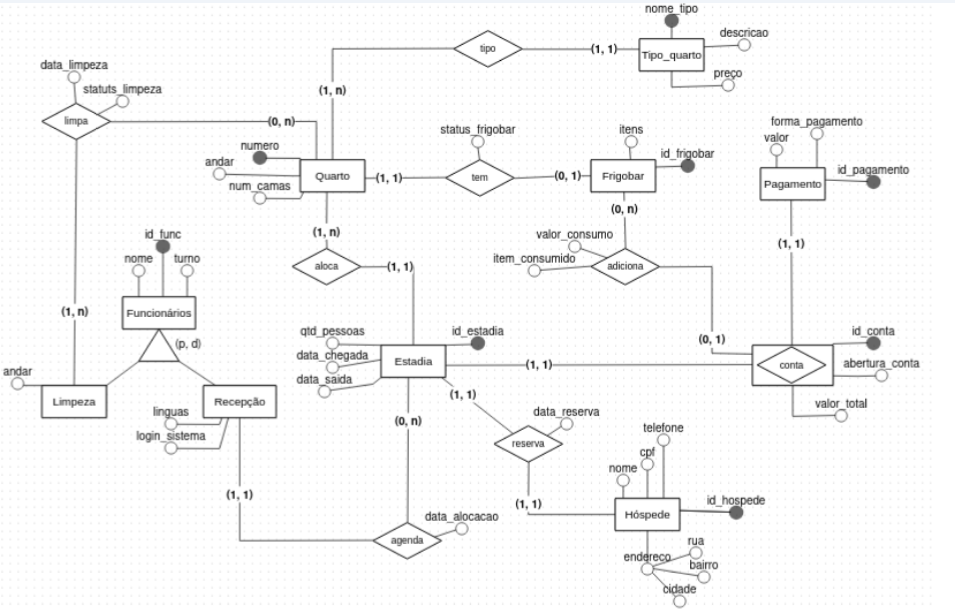

# Sistema de Hotel
> Projeto Final da disciplina de Banco de Dados I, utilizando JDBC e PostgreSQL.

## Sumário

Planeja-se criar um sistema de um hotel, focado nas operações diárias de
hospedagem, reservas, serviços e pagamentos. Sabe-se que os funcionários possuem seu
próprio número identificador no sistema e há dois tipos: os de recepção - cada reserva pode
ser registrada por um ou mais recepcionistas, enquanto um recepcionista pode agendar 0
ou mais estadias, visto que pode atuar em outras áreas da recepção - e os da limpeza - um
quarto deve ser limpo por uma ou mais funcionários dessa área, mas nem todo funcionário
precisa limpar quartos, visto que há outras áreas de hotel as quais precisam ser limpas.

Já um hóspede, registrado pelo seu cpf e é necessário saber seu nome, endereço e
telefone, pode reservar uma estadia - as quais podem ser reservadas por apenas um
hóspede e podem alocar um ou mais quartos - contendo data de entrada e de saída, além
de quantas pessoas irão ficar em cada quarto.

O hotel possui vários tipos de quartos (individual, Triplo, Suíte, entre outros), que
variam de preços e números de camas disponíveis. Cada quarto é reconhecido pelo seu
número e pode possuir nenhum ou um frigobar, o qual tem um status para indicar se está
cheio ou vazio e possui itens, que, se consumidos, são adicionados na conta junto com o
valor da estadia. O cliente pode escolher a forma de pagamento (débito, crédito, pix) e,
assim, finalizar sua estadia.

## Esquema Conceitual
O diagrama a seguir representa visualmente a descrição dada. Estão presentes entidades, relacionamentos, atributos, generalização/especialização e entidade associativa.

## Esquema Lógico Relacional

## Aplicação sobre o BD Relacional
Por fim, devemos utilizar uma API Relacional para criar uma aplicação sobre o BD relacional proposto. 

### Funcionalidades
A aplicação implementa:
* Inserir tuplas em todas as tabelas usadas
* Remover tuplas em todas as tabelas usadas
* Consultar com JOIN entre tabelas relacionadas
* Consulta com subconsulta + agregação
* Menu interativo pelo terminal
 
### Tabelas usadas
* Hóspede
* Funcionário
* Estadia
* Quarto
* Reserva

### Tecnologias usadas
  * Java
  * JDBC (Java Database Connectivity)
  * Apache NetBeans
  * PostgreSQL
  * Driver JDBC

## Autores
 * Maria Isabel de Moraes da Silva
 * Mariana Romanin Mendes

_Disciplina: Banco de Dados I | Professora: Rebeca Schroeder Freitas | 2025_

